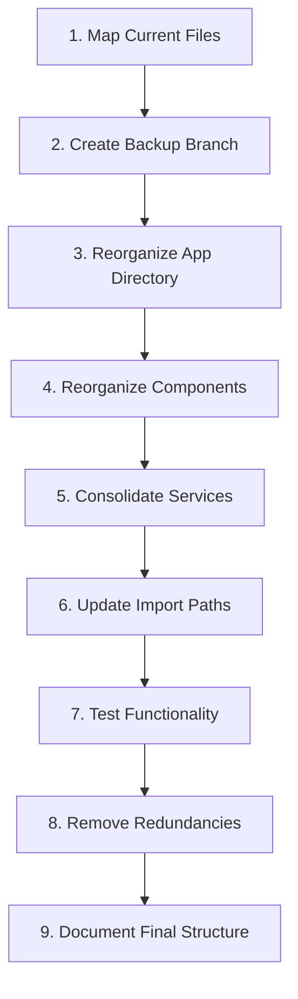

# binaaHub Enhanced File Organization Plan

**Date:** 2025-08-05  
**Author:** GitHub Copilot for Shafi-prog  
**Version:** 1.0

## 1. Executive Summary

This document outlines a comprehensive plan to optimize the binaaHub codebase organization without losing functionality or creating redundancy. The plan focuses on domain-driven organization, eliminating duplicate code, and ensuring all data comes from Supabase.

Based on the successful implementation of marketplace features, this plan addresses the remaining organizational opportunities to create a more maintainable, scalable codebase.

## 2. Current State Analysis

The current project structure has successfully implemented marketplace features but still has opportunities for improvement:

### Strengths
- ✅ Complete marketplace implementation
- ✅ Supabase integration for data management
- ✅ Enhanced cart system with real-time updates
- ✅ Security implementation with proper RLS policies

### Opportunities for Improvement
- 🔄 Some files organized by technical role rather than business domain
- 🔄 Multiple locations for related functionality
- 🔄 Legacy pages alongside new app router pages
- 🔄 Potential duplication in service and API layers

## 3. Reorganization Principles

The reorganization will follow these core principles:

1. **Domain-First Organization**: Group files by business domain first, technical role second
2. **Single Responsibility**: Each component should have one clear purpose
3. **No Redundancy**: Identify and consolidate duplicate functionality
4. **Supabase-Only Data**: Ensure all data comes from Supabase (no hardcoded values)
5. **Preserve Working Code**: Move files, don't rebuild them

## 4. Implementation Strategy



### Phase 1: File Mapping & Preparation (1-2 days)

1. **Create a comprehensive file inventory**
   ```bash
   find src -type f -name "*.tsx" -o -name "*.ts" > file_inventory.txt
   ```

2. **Analyze file relationships**
   - Map import dependencies between files
   - Identify files with similar functionality
   - Group files by business domain

3. **Create a backup branch**
   ```bash
   git checkout -b file-organization-backup
   git push origin file-organization-backup
   ```

4. **Create a working branch**
   ```bash
   git checkout -b enhanced-organization
   ```

### Phase 2: Directory Structure Implementation (2-3 days)

#### Target Directory Structure

```
src/
├── app/                     # Next.js App Router
│   ├── (public)/            # Public-facing routes
│   │   ├── marketplace/     # Public marketplace
│   │   ├── calculator/      # Construction calculator
│   │   └── journey/         # Construction journey info
│   │
│   ├── user/                # User domain (human users)
│   │   ├── dashboard/       # User dashboard
│   │   ├── projects/        # Project management
│   │   │   └── [projectId]/ # Individual project pages
│   │   │       ├── marketplace/ # Project marketplace
│   │   │       └── reports/     # Project reports
│   │   ├── profile/         # User profile
│   │   ├── cart/            # Shopping cart
│   │   └── settings/        # User settings
│   │
│   ├── store/               # Store domain (businesses)
│   │   ├── dashboard/       # Store dashboard
│   │   ├── products/        # Product management
│   │   ├── orders/          # Order management
│   │   ├── storefront/      # Storefront customization
│   │   └── [storeId]/       # Public storefront view
│   │
│   ├── admin/               # Admin section
│   │   ├── dashboard/       # Admin dashboard
│   │   └── settings/        # Platform settings
│   │
│   ├── auth/                # Authentication routes
│   │   ├── login/
│   │   └── register/
│   │
│   └── api/                 # API routes
│       ├── marketplace/
│       ├── projects/
│       ├── stores/
│       └── users/
│
├── components/              # React Components
│   ├── marketplace/         # Marketplace components
│   ├── project/             # Project components
│   ├── store/               # Store components
│   ├── user/                # User components
│   ├── auth/                # Authentication components
│   ├── shared/              # Cross-domain components
│   └── ui/                  # Pure UI components
│
├── services/                # Supabase Data Services
│   ├── marketplace.ts       # Marketplace data service
│   ├── project.ts           # Project data service
│   ├── store.ts             # Store data service
│   ├── user.ts              # User data service
│   ├── auth.ts              # Authentication service
│   └── order.ts             # Order processing service
│
├── hooks/                   # React Hooks
│   ├── useMarketplace.ts    # Marketplace hooks
│   ├── useProject.ts        # Project hooks
│   ├── useStore.ts          # Store hooks
│   ├── useCart.ts           # Cart hooks
│   └── useAuth.ts           # Authentication hooks
│
├── types/                   # TypeScript Types
│   ├── marketplace.ts       # Marketplace types
│   ├── project.ts           # Project types
│   ├── store.ts             # Store types
│   ├── user.ts              # User types
│   └── order.ts             # Order types
│
├── lib/                     # Utility functions
│   ├── supabase.ts          # Supabase client
│   ├── utils.ts             # General utilities
│   └── api.ts               # API utilities
│
└── middleware.ts            # Next.js middleware
```

### Phase 3: File Movement Process (3-4 days)

#### Step 1: Implement App Directory Structure
```bash
# Create new directories
mkdir -p src/app/(public)/marketplace
mkdir -p src/app/(public)/calculator
mkdir -p src/app/(public)/journey
mkdir -p src/app/user/projects
mkdir -p src/app/user/dashboard
mkdir -p src/app/user/profile
mkdir -p src/app/user/cart
mkdir -p src/app/store/dashboard
mkdir -p src/app/store/products
mkdir -p src/app/store/orders
mkdir -p src/app/admin/dashboard
mkdir -p src/app/auth/login
mkdir -p src/app/auth/register
```

#### Step 2: Move Page Components by Domain

For each domain, move page components to their respective directories:

**Public Marketplace Pages:**
```bash
# Use git mv to preserve history
git mv src/app/marketplace/page.tsx src/app/(public)/marketplace/page.tsx
git mv src/app/marketplace/[category]/page.tsx src/app/(public)/marketplace/[category]/page.tsx
```

**User Pages:**
```bash
git mv src/app/dashboard/page.tsx src/app/user/dashboard/page.tsx
git mv src/app/projects/page.tsx src/app/user/projects/page.tsx
git mv src/app/projects/[projectId]/page.tsx src/app/user/projects/[projectId]/page.tsx
git mv src/app/projects/[projectId]/marketplace/page.tsx src/app/user/projects/[projectId]/marketplace/page.tsx
```

**Store Pages:**
```bash
git mv src/app/store/dashboard/page.tsx src/app/store/dashboard/page.tsx
git mv src/app/store/[storeId]/page.tsx src/app/store/[storeId]/page.tsx
git mv src/app/store/products/page.tsx src/app/store/products/page.tsx
git mv src/app/store/products/[productId]/page.tsx src/app/store/products/[productId]/page.tsx
```

**Authentication Pages:**
```bash
git mv src/app/auth/login/page.tsx src/app/auth/login/page.tsx
git mv src/app/auth/register/page.tsx src/app/auth/register/page.tsx
```

#### Step 3: Reorganize Components by Domain

Move components to their domain-specific directories:

```bash
# Create domain component directories
mkdir -p src/components/marketplace
mkdir -p src/components/project
mkdir -p src/components/store
mkdir -p src/components/user
mkdir -p src/components/auth
mkdir -p src/components/shared
mkdir -p src/components/ui

# Move marketplace components
git mv src/components/marketplace/ProductCard.tsx src/components/marketplace/
git mv src/components/marketplace/ProductGrid.tsx src/components/marketplace/
git mv src/components/marketplace/CategoryFilter.tsx src/components/marketplace/

# Move project components
git mv src/components/project/ProjectMarketplace.tsx src/components/project/
git mv src/components/project/ProjectProductSelector.tsx src/components/project/

# Move store components
git mv src/components/storefront/StorefrontHeader.tsx src/components/store/
git mv src/components/storefront/StorefrontProducts.tsx src/components/store/

# Move UI components
git mv src/components/ui/* src/components/ui/
```

#### Step 4: Consolidate Services and Hooks

```bash
# Create service directory
mkdir -p src/services

# Move services to dedicated files
git mv src/lib/marketplaceService.ts src/services/marketplace.ts
git mv src/lib/projectService.ts src/services/project.ts
git mv src/lib/storeService.ts src/services/store.ts
git mv src/lib/userService.ts src/services/user.ts
git mv src/lib/authService.ts src/services/auth.ts
git mv src/lib/orderService.ts src/services/order.ts

# Create hooks directory
mkdir -p src/hooks

# Move hooks to dedicated files
git mv src/hooks/useMarketplace.ts src/hooks/
git mv src/hooks/useProject.ts src/hooks/
git mv src/hooks/useCart.ts src/hooks/
git mv src/hooks/useStore.ts src/hooks/
git mv src/hooks/useAuth.ts src/hooks/
```

### Phase 4: Update Import Paths (2-3 days)

Update import paths in all files to reflect the new directory structure.

```typescript
// Example: Before
import { ProductCard } from '../../components/marketplace/ProductCard';
import { useMarketplace } from '../../hooks/useMarketplace';

// Example: After
import { ProductCard } from '@/components/marketplace/ProductCard';
import { useMarketplace } from '@/hooks/useMarketplace';
```

Use path aliases to simplify imports:

```javascript
// next.config.js
const nextConfig = {
  // ... other config
  webpack: (config) => {
    config.resolve.alias = {
      ...config.resolve.alias,
      '@': path.resolve(__dirname, 'src/'),
      '@components': path.resolve(__dirname, 'src/components/'),
      '@services': path.resolve(__dirname, 'src/services/'),
      '@hooks': path.resolve(__dirname, 'src/hooks/'),
      '@types': path.resolve(__dirname, 'src/types/'),
    };
    return config;
  },
};
```

Update `tsconfig.json`:

```json
{
  "compilerOptions": {
    "baseUrl": ".",
    "paths": {
      "@/*": ["src/*"],
      "@components/*": ["src/components/*"],
      "@services/*": ["src/services/*"],
      "@hooks/*": ["src/hooks/*"],
      "@types/*": ["src/types/*"]
    }
  }
}
```

### Phase 5: Testing and Validation (2-3 days)

1. **Test each domain independently**
   - Verify marketplace functionality
   - Test project integration
   - Validate store features
   - Check authentication flows

2. **Cross-domain integration tests**
   - Test marketplace-to-project flows
   - Validate cart-to-order processes
   - Verify authentication across features

3. **Performance testing**
   - Measure page load times
   - Check API response times
   - Verify database query performance

### Phase 6: Redundancy Removal (1-2 days)

Once the new structure is validated, identify and remove redundant files:

```bash
# Create a list of potentially redundant files
find src -type f -name "*.tsx" -o -name "*.ts" | sort > all_files.txt

# Check each file for duplication
# This would be a manual process to ensure no functionality is lost
```

For each duplicate file:
1. Verify the new location has all functionality
2. Check for any unique code in the duplicate
3. Merge any unique code into the canonical version
4. Remove the duplicate after thorough testing

## 5. Domain-Specific Improvements

### Marketplace Domain

1. **Unified Product Card Component**

```tsx
// src/components/marketplace/ProductCard.tsx
import React from 'react';
import Image from 'next/image';
import { Button } from '@/components/ui/button';
import { useCart } from '@/hooks/useCart';
import { Product } from '@/types/marketplace';

interface ProductCardProps {
  product: Product;
  variant?: 'default' | 'compact' | 'grid';
  showAddToProject?: boolean;
  projectId?: string;
  className?: string;
}

export const ProductCard: React.FC<ProductCardProps> = ({
  product,
  variant = 'default',
  showAddToProject = false,
  projectId,
  className = '',
}) => {
  const { addToCart } = useCart();
  
  // Component implementation based on variant
  // All data from product object, no hardcoded values
};
```

2. **Enhanced Marketplace Service**

```typescript
// src/services/marketplace.ts
import { supabase } from '@/lib/supabase';
import { Product, Category, Store } from '@/types/marketplace';

export const marketplaceService = {
  /**
   * Get products with filtering options
   */
  async getProducts({
    category,
    storeId,
    search,
    limit = 20,
    page = 1,
  }: {
    category?: string;
    storeId?: string;
    search?: string;
    limit?: number;
    page?: number;
  }): Promise<{ data: Product[]; count: number }> {
    let query = supabase
      .from('products')
      .select('*, stores:store_id(*)', { count: 'exact' });
    
    // Apply filters
    if (category) query = query.eq('category', category);
    if (storeId) query = query.eq('store_id', storeId);
    if (search) query = query.ilike('name', `%${search}%`);
    
    // Pagination
    const from = (page - 1) * limit;
    const to = from + limit - 1;
    
    const { data, error, count } = await query.range(from, to);
    
    if (error) throw error;
    
    return { 
      data: data as Product[], 
      count: count || 0 
    };
  },
  
  // Other marketplace methods...
};
```

### Project Domain

1. **Project-Marketplace Integration**

```tsx
// src/components/project/ProjectMarketplace.tsx
import React from 'react';
import { useProject } from '@/hooks/useProject';
import { ProductGrid } from '@/components/marketplace/ProductGrid';
import { CategoryFilter } from '@/components/marketplace/CategoryFilter';
import { ProductSearch } from '@/components/marketplace/ProductSearch';
import { OrderSummary } from '@/components/project/OrderSummary';

interface ProjectMarketplaceProps {
  projectId: string;
}

export const ProjectMarketplace: React.FC<ProjectMarketplaceProps> = ({
  projectId,
}) => {
  const { project, addProductToProject } = useProject(projectId);
  
  // Implementation that integrates marketplace with project
  // No hardcoded data, all from Supabase
};
```

### Store Domain

1. **Storefront Customization**

```tsx
// src/components/store/StorefrontCustomizer.tsx
import React from 'react';
import { useStore } from '@/hooks/useStore';
import { ColorPicker } from '@/components/ui/color-picker';
import { ImageUploader } from '@/components/ui/image-uploader';

interface StorefrontCustomizerProps {
  storeId: string;
}

export const StorefrontCustomizer: React.FC<StorefrontCustomizerProps> = ({
  storeId,
}) => {
  const { store, updateStoreTheme, updateStoreLogo } = useStore(storeId);
  
  // Implementation for customizing storefront
  // All data from Supabase
};
```

## 6. Migration Guidance for Specific Components

### Cart System

```typescript
// src/hooks/useCart.ts
import { useState, useEffect } from 'react';
import { useAuth } from '@/hooks/useAuth';
import { cartService } from '@/services/cart';

export function useCart() {
  const { user } = useAuth();
  const [cartItems, setCartItems] = useState([]);
  const [isLoading, setIsLoading] = useState(true);
  
  useEffect(() => {
    if (user) {
      loadCart();
    } else {
      setCartItems([]);
      setIsLoading(false);
    }
  }, [user]);
  
  const loadCart = async () => {
    setIsLoading(true);
    try {
      const items = await cartService.getCartItems(user.id);
      setCartItems(items);
    } catch (error) {
      console.error('Failed to load cart:', error);
    } finally {
      setIsLoading(false);
    }
  };
  
  // Other cart operations...
  
  return {
    cartItems,
    isLoading,
    addToCart: (product, quantity) => {},
    removeFromCart: (itemId) => {},
    updateQuantity: (itemId, quantity) => {},
    clearCart: () => {},
    // Computed properties
    totalItems: cartItems.reduce((sum, item) => sum + item.quantity, 0),
    subtotal: cartItems.reduce((sum, item) => sum + (item.price * item.quantity), 0),
  };
}
```

### Authentication System

Ensure authentication components are consistent and only use Supabase:

```typescript
// src/hooks/useAuth.ts
import { useState, useEffect, createContext, useContext } from 'react';
import { supabase } from '@/lib/supabase';
import { User } from '@supabase/supabase-js';

export function useAuth() {
  const [user, setUser] = useState<User | null>(null);
  const [isLoading, setIsLoading] = useState(true);
  
  useEffect(() => {
    // Set up auth state listener
    const { data: { subscription } } = supabase.auth.onAuthStateChange(
      (event, session) => {
        setUser(session?.user ?? null);
        setIsLoading(false);
      }
    );
    
    // Get initial session
    supabase.auth.getSession().then(({ data: { session } }) => {
      setUser(session?.user ?? null);
      setIsLoading(false);
    });
    
    return () => {
      subscription.unsubscribe();
    };
  }, []);
  
  return {
    user,
    isLoading,
    signIn: async (email, password) => {},
    signUp: async (email, password, userData) => {},
    signOut: async () => {},
    resetPassword: async (email) => {},
  };
}
```

## 7. Testing Strategy

Implement a comprehensive testing approach to ensure no functionality is lost:

1. **Unit Tests for Core Components**
   ```
   src/components/marketplace/ProductCard.test.tsx
   src/components/project/ProjectMarketplace.test.tsx
   src/hooks/useCart.test.ts
   ```

2. **Integration Tests for Key Flows**
   ```
   src/tests/marketplace-browsing.test.tsx
   src/tests/add-to-cart.test.tsx
   src/tests/project-marketplace.test.tsx
   ```

3. **End-to-End Tests for Critical Paths**
   ```
   src/e2e/browse-and-purchase.test.ts
   src/e2e/project-creation.test.ts
   src/e2e/store-management.test.ts
   ```

## 8. Rollback Plan

In case of issues, implement this rollback strategy:

1. **Feature Flags for Progressive Rollout**
   ```typescript
   // src/lib/features.ts
   export const FEATURES = {
     USE_NEW_DIRECTORY_STRUCTURE: process.env.NEXT_PUBLIC_USE_NEW_STRUCTURE === 'true',
   };
   
   // Usage in code
   import { FEATURES } from '@/lib/features';
   
   export default function Page() {
     if (FEATURES.USE_NEW_DIRECTORY_STRUCTURE) {
       return <NewImplementation />;
     }
     return <LegacyImplementation />;
   }
   ```

2. **Git Revert Plan**
   ```bash
   # If needed, revert to the backup branch
   git checkout file-organization-backup
   git merge -s ours main
   git checkout main
   git merge file-organization-backup
   ```

## 9. Implementation Timeline

| Phase | Duration | Description |
|-------|----------|-------------|
| 1. File Mapping & Preparation | 1-2 days | Analyze current structure and create backup |
| 2. Directory Structure Implementation | 2-3 days | Create new directories and structure |
| 3. File Movement Process | 3-4 days | Move files to new locations |
| 4. Update Import Paths | 2-3 days | Fix imports and references |
| 5. Testing and Validation | 2-3 days | Verify functionality |
| 6. Redundancy Removal | 1-2 days | Remove duplicate files |
| **Total** | **11-17 days** | Complete reorganization |

## 10. Conclusion

This file organization plan will significantly improve the binaaHub codebase by:

1. **Organizing by domain** for better maintainability
2. **Eliminating redundancy** for a cleaner codebase
3. **Ensuring data consistency** with Supabase-only approach
4. **Preserving functionality** while improving structure

The domain-driven organization will make it easier to understand, maintain, and extend the platform while the unified approach ensures consistency across all areas of the application.

## Appendix: File Movement Script

```javascript
// scripts/move-files.js
const fs = require('fs');
const path = require('path');
const { execSync } = require('child_process');

// Define file mapping
const fileMapping = {
  'src/app/marketplace/page.tsx': 'src/app/(public)/marketplace/page.tsx',
  'src/app/dashboard/page.tsx': 'src/app/user/dashboard/page.tsx',
  // Add more mappings as needed
};

// Process each file
Object.entries(fileMapping).forEach(([source, destination]) => {
  // Ensure destination directory exists
  const destDir = path.dirname(destination);
  if (!fs.existsSync(destDir)) {
    fs.mkdirSync(destDir, { recursive: true });
    console.log(`Created directory: ${destDir}`);
  }
  
  // Move file using git mv to preserve history
  try {
    execSync(`git mv "${source}" "${destination}"`);
    console.log(`Moved: ${source} → ${destination}`);
  } catch (error) {
    console.error(`Error moving ${source}: ${error.message}`);
  }
});

console.log('File movement complete!');
```